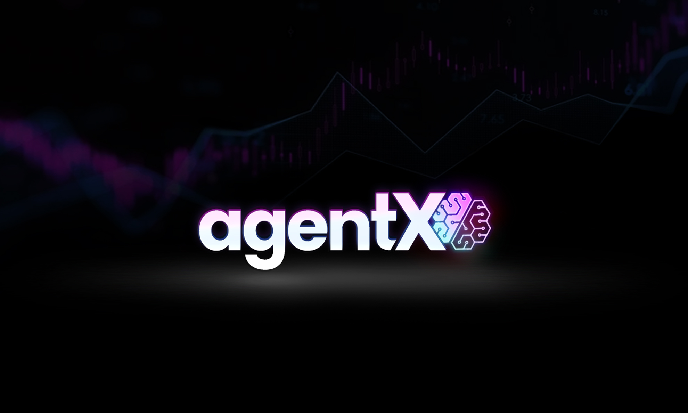

# Agent-X: An Autonomous Crypto Trading Agent



## LSTM Price Predictor | EvoSearch Optimizer | IndicatorSet Confirmer | OKX & CCXT API

**Agent-X** is a self-improving, autonomous crypto trading bot designed to operate on the OKX exchange. It leverages a hybrid strategy combining a Long Short-Term Memory (LSTM) neural network with a technical set of indicators to help the agent make informed trading decisions. The agent continuously learns and adapts to market conditions through a process of walk-forward optimization and evolutionary search (EvoSearch).

**Disclaimer:** This is an experimental trading bot. Trading cryptocurrencies involves substantial risk, and you can lose all your capital. This is not financial advice. Use this strategy and it's code at your own risk. Before even considering to use this strategy on live markets you should conduct your own thorough testing in demo mode.

---

## Table of Contents

- [Getting Started](#getting-started)
  - [Installation](#installation)
  - [API Configuration](#api-configuration)
- [How Agent-X Works: A Deep Dive](#how-agent-x-works-a-deep-dive)
  - [1. The Learning Cycle (`train` mode)](#1-the-learning-cycle-train-mode)
  - [2. Live Trading (`live` mode)](#2-live-trading-live-mode)
- [The Strategy Explained](#the-strategy-explained)
  - [Signal Generation](#signal-generation)
  - [Exit Logic](#exit-logic)
  - [Risk Management](#risk-management)
- [User Configuration Guide](#user-configuration-guide)
  - [What You MUST Configure](#what-you-must-configure)
  - [What You CAN Configure](#what-you-can-configure)
  - [Advanced Configuration (Experts Only)](#advanced-configuration)
- [Usage](#usage)
  - [Training Mode](#training-mode)
  - [Live Trading Mode](#live-trading-mode)
- [Trading Modes: Demo vs. Live](#trading-modes-demo-vs-live)

---

## Getting Started

### Installation

1. Clone the repository.
2. Install the required Python dependencies (Python 3.10+ recommended)

    ```bash
    pip install -r requirements.txt
    ```

### API Configuration

Agent-X needs API credentials to connect to OKX. These are stored in a `.env` file.

1. Create a file named `.env` in the root directory of the project.
2. Add your OKX API credentials to this file. For demo trading, you can get these from the "Demo Trading" section of your OKX account.

    ```dotenv
    YOUR_API_KEY="your-api-key-here"
    YOUR_SECRET_KEY="your-secret-key-here"
    YOUR_PASSPHRASE="your-passphrase-here"
    ```

**IMPORTANT:** The `.gitignore` file is configured to ignore the `.env` file, ensuring your secrets are never accidentally committed to a repository.

---

## How Agent-X Works: A Deep Dive

Agent-X operates in two main modes: `train` and `live`. The `train` mode is where the agent learns, and the `live` mode is where it executes trades based on that learning.

### 1. The Learning Cycle (`train` mode)

When you run the bot in `train` mode, it performs a sophisticated learning process to find the best strategy parameters for the current market.

**Workflow:**

1. **Data Collection**: The agent fetches a large amount of historical price data for the configured trading pair (e.g., 100,000 bars).
2. **Walk-Forward Optimization**: To avoid looking into the future (and getting unrealistic results), the agent uses a portion of this data for training and reserves the rest for testing. This cycle involves two key steps:
   - **A) LSTM Model Training (`agent_x/model.py`)**: An LSTM neural network is trained on recent price data (e.g., the last 75,000 bars). Its goal is to predict the price a few bars into the future. The trained model is saved as `state/lstm_model.keras`.
   - **B) EvoSearch Optimizer (`agent_x/optimize.py`)**: This is the core of the learning process.
     - **What is it?** An evolutionary algorithm that intelligently searches for the best possible strategy parameters.
     - **How it works:**
        1. It creates an initial "population" of random strategy parameters.
        2. It runs a backtest for each set of parameters and assigns a "fitness score" based on performance (a combination of profit (CAGR), risk-adjusted return (Sharpe), and low drawdown).
        3. It takes the best-performing parameters ("elites"), "mutates" them slightly to create new variations, and discards the worst performers.
        4. This process repeats for several "generations", gradually evolving towards a highly optimized set of parameters.
     - **Additional Details:**
       - The optimizer tests a few manual ultra-aggressive parameter sets initially to seed the population.
       - Mutation includes adjusting indicator weights, exit modes, and various thresholds within defined ranges.
       - The scoring function heavily penalizes parameter sets that produce no trades.
       - The optimizer caches model predictions to speed up evaluation.
     - **What can't be updated by the user?** You should not interfere with the EvoSearch process directly. It is designed to be autonomous. The key takeaway is that it tests thousands of parameter combinations to find what works best *right now*.
3. **Final Backtest**: Once the EvoSearch is complete, the single best set of parameters is saved to `state/best_params.json`. A final, full backtest is run using this optimal configuration, and the results (equity curve, performance metrics) are saved to the `state/` directory.

### 2. Live Trading (`live` mode)

When you run the bot in `live` mode, it uses the knowledge gained during the training phase to trade in real-time.

**Workflow:**

1. **Initialization**: The agent loads the pre-trained LSTM model (`lstm_model.keras`) and the optimized strategy parameters (`best_params.json`).
2. **Real-Time Data**: It connects to the OKX WebSocket to receive a live feed of candle data for the trading pair.
3. **Signal Generation & Execution**: For each new candle, the agent:
   - Generates a trading signal (Long, Short, or Flat) based on the LSTM prediction and composite indicator signals.
   - Calculates the appropriate position size based on its risk management rules.
   - Places market orders to enter or exit positions.
4. **Position Tracking**: The agent tracks open positions and scaling levels, updating its state based on WebSocket position and account updates.
5. **Continuous Learning**: The agent will automatically re-run the entire learning cycle periodically (defined by `reoptimize_hours` in the config) to adapt to changing market dynamics.
6. **Order Management**: The agent cancels pending orders and closes existing positions on startup to ensure a clean state.

---

## The Strategy Explained

### Signal Generation

A trading signal is not based on a single factor. It's a hybrid decision made by combining two sources of information:

1. **LSTM Prediction**: The neural network predicts the future price. If the predicted price is significantly higher than the current price (by a `prediction_threshold`), it's a bullish signal. If it's significantly lower, it's bearish.
2. **Composite Indicator Score**: A weighted average of three classic technical indicators:
   - **RSI (Relative Strength Index)**: Identifies overbought or oversold conditions.
   - **MACD (Moving Average Convergence Divergence)**: Measures trend momentum.
   - **Bollinger Bands**: Measures volatility and potential price breakouts.

A **trade is only entered** when the LSTM prediction and the composite indicator score agree. For example, to go LONG, the LSTM must predict a price increase, AND the indicators must show bullish momentum.

### Position Scaling and Partial Exits

Agent-X supports scaling into positions and partial exits to manage risk and maximize profits:

- **Scaling Positions**: The strategy can open multiple position levels (up to `max_open_orders`), adding to the position as the price moves favorably beyond configured `scaling_thresholds` (e.g., 1%, 2% price moves).
- **Partial Exits**: The strategy can close parts of the position at configured `partial_exit_thresholds` (e.g., 0.5%, 1%, 1.5% profit retracements) to lock in gains while keeping some exposure.
- Position sizing for each level is adjusted by predefined scaling ratios (e.g., 100%, 50%, 25% of base size).

### Exit Logic

The strategy for exiting a trade is controlled by the `exit_mode` parameter, which is determined by the EvoSearch optimizer.

- `mechanical`: Uses a combination of a stop-loss based on the Average True Range (ATR) and a multi-stage trailing stop-loss that tightens as a trade becomes more profitable.
- `intelligent`: In addition to the mechanical stops, this mode will also exit a trade if the LSTM model's prediction strongly disagrees with the current position. For example, if the bot is in a LONG position but the LSTM suddenly predicts a sharp price drop.

### Risk Management

Agent-X has a sophisticated risk manager (`agent_x/risk.py`) that calculates position size for every trade. **This is one of the most critical components for capital preservation.**

The size of any given trade is determined by taking the *minimum* of several calculations to ensure it never exceeds any single risk limit:

- **Leverage Cap**: Does not exceed the `max_leverage` set in the config.
- **Exposure Cap**: Does not use more of your total equity than `max_exposure`.
- **Risk-per-Trade Cap**: Sizes the trade such that if the price moves against you by one ATR (a measure of volatility), the loss will not exceed `risk_per_trade`.
- **Dynamic Risk Adjustment**: Uses recent performance and equity growth to adjust risk dynamically, including a Kelly criterion based scaling.
- **Micro-position Scaling**: Ensures minimum viable trade sizes for small capital accounts.
- **Scaling Ratios**: Applies decreasing position sizes for scaling into multiple levels (e.g., 100%, 50%, 25%).

---

## User Configuration Guide

The primary way to configure the bot is by editing the `agent_x/config.py` file or by setting environment variables.

### What You MUST Configure

- You must provide your API keys in a .env to connect to the exchange.

### What You CAN Configure

These are settings in `config.py` that you can safely adjust to your preferences.

- `symbol`: The trading pair you want to trade (e.g., "BTC-USDT-SWAP").
- `timeframe`: The candle interval (e.g., "5m", "1h").
- `risk`:
  - `backtest_equity`: The initial capital to use for backtesting.
  - `vol_target`: A measure of how much risk you want for your whole portfolio.
  - `max_leverage`: The maximum leverage to use.
  - `max_daily_loss`: A circuit breaker; if the bot loses this percentage of equity in a day, it will stop trading (not yet fully implemented).
  - `max_exposure`: The maximum percentage of your capital you are willing to have in the market at once.
  - `risk_per_trade`: The maximum percentage of your equity you are willing to risk on a single trade.
- `runtime`:
  - `reoptimize_hours`: How often the bot should re-run the full learning cycle.
  - `demo`: Set to `True` for paper trading, `False` for live trading with real funds.

### Configuration Presets

Agent-X provides several configuration presets optimized for different trading styles and capital sizes. These presets are available in `agent_x/config.py` and can be used by calling the respective functions:

#### Ultra-Aggressive Preset (`get_ultra_aggressive_params()`)

Optimized for traders seeking maximum returns with higher risk tolerance:

- **Prediction Threshold**: 0.0008 (more aggressive entries)
- **Indicator Weights**: Favor momentum more (RSI: 0.45, MACD: 0.35, BB: 0.2)
- **Exit Mode**: Mechanical (simpler exit logic)
- **ATR Stop Loss Multiplier**: 1.8 (tighter stops)
- **Initial Trail Percentage**: 4% (4% trailing stop)
- **Profit Trigger Percentage**: 2.5% (lower profit targets for more frequent exits)
- **LSTM Disagreement Percentage**: 0.8% (slightly less strict disagreement)

**Use Case**: When you want to capture more market moves but are willing to accept more frequent stops and smaller wins.

#### Small Capital Preset (`load_config_for_small_cap()`)

Optimized for traders starting with limited capital (e.g., $25):

- **Risk per Trade**: 45% (higher risk per trade for small capital)
- **Max Daily Loss**: 12% (slightly looser daily loss limit)
- **Scaling Thresholds**: [0.008, 0.018] (lower thresholds for more frequent scaling)
- **Position Ratios**: [1.0, 0.6, 0.3] (adjusted for better scaling)
- **Prediction Threshold**: 0.0015 (more aggressive for small accounts)
- **ATR Stop Loss Multiplier**: 2.5 (balanced stops)

**Use Case**: When trading with small amounts where position sizing and frequent scaling are crucial for growth.

#### How to Use Presets

To use a preset, modify your `agent_x/config.py` or create a custom configuration:

```python
from agent_x.config import load_config, get_ultra_aggressive_params

# Load base config
cfg = load_config()

# Apply ultra-aggressive preset
ultra_params = get_ultra_aggressive_params()
cfg["lstm_params"] = ultra_params

# Or for small capital
cfg = load_config_for_small_cap(starting_capital=25.0)
```

### Loading Configuration from User-Supplied File

While Agent-X primarily uses environment variables for configuration, you can also load settings from a custom JSON configuration file. This is useful for managing multiple configurations or deploying in different environments.

To load from a custom config file:

  1. Create a JSON file (e.g., `my_config.json`) with your desired settings:
    ```json
    {
      "symbol": "ETH-USDT-SWAP",
      "timeframe": "15m",
      "risk": {
        "backtest_equity": 100.0,
        "max_leverage": 5.0,
        "max_daily_loss": 0.15,
        "max_exposure": 0.8,
        "risk_per_trade": 0.2
      },
      "runtime": {
        "reoptimize_hours": 12,
        "demo": true
      }
    }
    ```

  2. Modify your script to load and merge the custom config:
    ```python
    import json
    from agent_x.config import load_config
    # Load base config
    cfg = load_config()
    # Load custom config
    with open('my_config.json', 'r') as f:
        custom_cfg = json.load(f)
    # Merge custom config (custom_cfg takes precedence)
    def merge_configs(base, custom):
        for key, value in custom.items():
            if isinstance(value, dict) and key in base:
                merge_configs(base[key], value)
            else:
                base[key] = value
        return base
    cfg = merge_configs(cfg, custom_cfg)
    ```

This approach allows you to maintain different configurations for different trading scenarios while keeping sensitive information (API keys) in environment variables.

### Advanced Configuration

These settings dramatically affect the learning process. **It is strongly recommended that you do not change these unless you fully understand the implications.** The EvoSearch optimizer is designed to find the best values for the `exit_logic` parameters on its own.

- `walk_forward`: Parameters for the optimizer, like population size (`pop`) and number of generations (`gens`).
- `lstm_params`: The architecture of the neural network (sequence length, epochs, etc.).
- `exit_logic`: The specific thresholds and multipliers for the exit strategy.

---

## Usage

### Training Mode

To run a single learning cycle (data fetch -> train -> optimize -> backtest):

```bash
python -m agent_x.cli train
#or
python -m agent_x train # both ways work the exactly the same
```

This will generate the latest model and parameter files in the `state/` directory as well as generte the backtest_plot.png image with the performance results from the backtest.

### Live Trading Mode

To start the live trading loop, which uses the latest files from the `state/` directory:

```bash
python -m agent_x.cli live
#or
python -m agent_x live # both ways work the exactly the same
```

---

## Backtest Plotting Script

Agent-X includes a script to visualize backtest results and diagnostics.

- **Location:** `scripts/plot_backtest.py`
- **Input:** Reads equity curve data from `state/equity_curve.csv` (columns: timestamp, equity).
- **Output:** Generates a plot saved as `state/backtest_plot.png`.
- **Features:**
  - Equity curve with underwater shading.
  - Drawdown chart.
  - Returns distribution histogram.
  - Markers for trade entries, scaling entries, and exits.
  - Performance metrics overlay (CAGR, Sharpe ratio, Max Drawdown, Start and Final equity).
- **Usage:**
    You can also generate a backtest_plot.png image that uses your own user provided csv data. Simply save the csv file with your trade history either within the strategy files or somewhere on your computer. Copy the path to your csv file you want to generate a backtest_plot for and add it in place of the placeholders below:

```bash
python scripts/plot_backtest.py [input_csv] [output_png] [trade_history_csv]
```

If no arguments are provided, defaults are used.

---

## Trading Modes: Demo vs. Live

Agent-X's behavior is controlled by the `demo` flag in `agent_x/config.py` or the `OKX_DEMO` environment variable.

### Demo Mode (`demo: True`)

- **Purpose**: Simulated trading for testing and development.
- **Implementation**: Uses the OKX REST API with a special header (`x-simulated-trading: 1`) that simulates trades without using real money.
- **Data Source**: Connects to OKX's demo WebSocket endpoints (`wspap.okx.com`).
- **Risk**: No real money is at stake. This is the **recommended mode** for all initial testing.

### Live Mode (`demo: False`)

- **Purpose**: Real trading with actual funds on OKX.
- **Implementation**: Uses the `ccxt` library, a robust framework for interacting with cryptocurrency exchanges.
- **Data Source**: Connects to OKX's live production WebSocket endpoints (`ws.okx.com`).
- **Risk**: **You will be trading with real money.** Ensure your configuration is correct and you have tested your strategy thoroughly in demo mode first.
